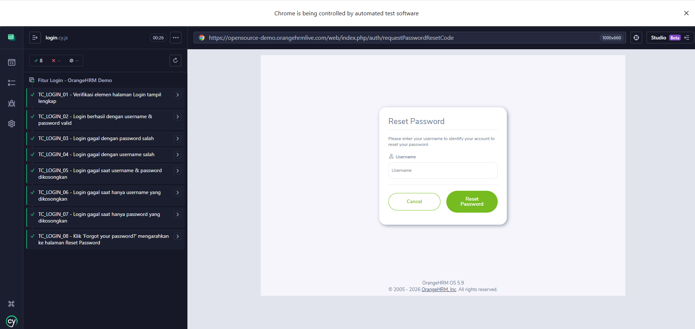
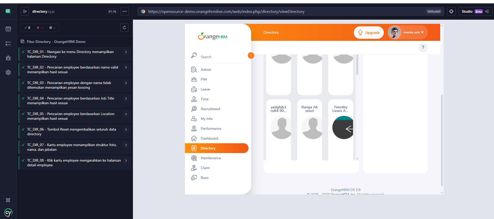
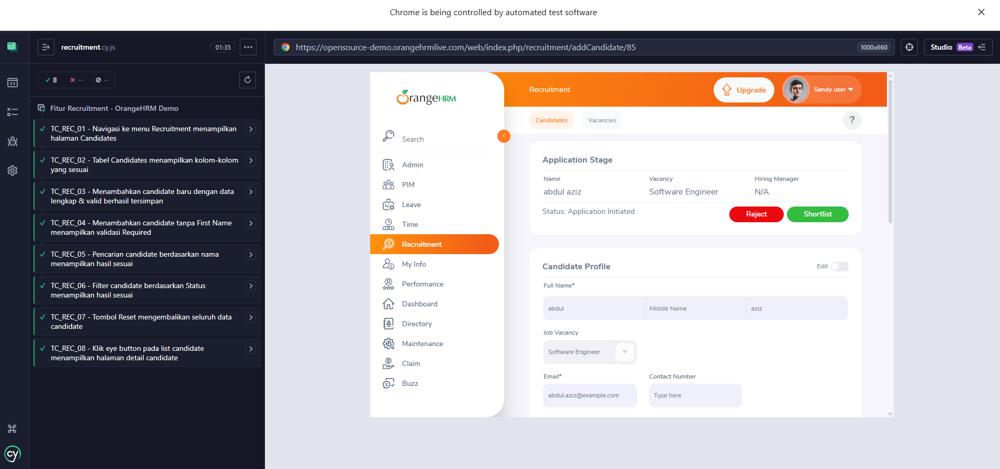

# 🍊 OrangeHRM Automation Testing using Cypress

Proyek ini adalah **Otomatisasi Pengujian E2E (End-to-End)** pada modul Login, Directory, & Recruitment platform **OrangeHRM Open Source** menggunakan kerangka kerja **Cypress**.

---

## 🚀 Hasil Eksekusi Pengujian

Seluruh skenario uji (**24 Test Cases Login, Directory, & Recruitment**) telah dieksekusi dan dinyatakan **Lolos (PASSED)** dengan tingkat keberhasilan 100%.

Hasil Eksekusi Login :


Hasil Eksekusi Directory :


Hasil Eksekusi Recruitment :


---

## 🛠️ Spesifikasi Teknologi & Dependensi

Proyek ini dibangun menggunakan susunan teknologi berikut:

- **Bahasa Pemrograman:** JavaScript (ES6+)
- **Framework Pengujian:** Cypress (v15.21.1)
- **Aplikasi Target:** OrangeHRM Open Source Live Demo

---

## 🗂️ Test Documentation

Berikut data Test Scenario & Test Case Orange HRM modul Login, Directory, & Recruitment :
📄 [`./OrangeHRM_TestScenario_TestCase.xlsx`](./OrangeHRM_TestScenario_TestCase.xlsx) / [Test Scenario & Test Case spreadsheets](https://docs.google.com/spreadsheets/d/1lNeqrqPhLRg6n41CHLy1tFzfVigAVsrb/edit?usp=sharing&ouid=109837913803375586172&rtpof=true&sd=true)

---

## 💻 Langkah-Langkah Menjalankan Pengujian secara Lokal

Ikuti petunjuk di bawah ini untuk mengkloning dan mengeksekusi proyek ini di perangkat lokal Anda.

### 1. Prasyarat System

Pastikan perangkat Anda sudah terinstal **Node.js** (Rekomendasi versi LTS terbaru).

### 2. Kloning Repositori

```bash
git clone https://github.com/ahmadubaidillah/orangehrm-cypress-automation
cd orangehrm-cypress-automation
```

### 3. Instalasi Dependensi

Jalankan perintah berikut untuk mengunduh package Cypress yang terdaftar di `package.json`:

```bash
npm install
```

### 4. Menjalankan Tes Melalui Cypress UI (Test Runner)

Untuk membuka antarmuka grafis (GUI) Cypress dan memilih berkas tes secara interaktif:

```bash
npm run cy:open
```

---

## 👤 Author

**Ahmad Ubaidillah Asshidiqi**
Junior QA Engineer

- LinkedIn: [LinkedIn](https://id.linkedin.com/in/ahmad-ubaidillah-asshidiqi)
- GitHub: [Github](https://github.com/ahmadubaidillah)
